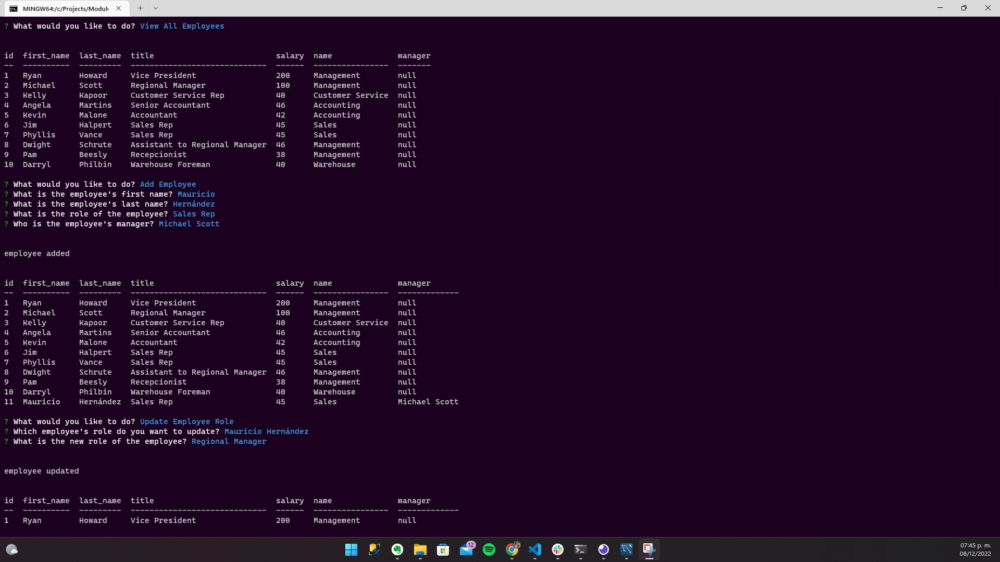

# employee DB
## Challenge Module 12
### Último cambio: Mauricio García Hernández 08/Dec/2022

### User Story:
COMO propietario de un negocio
QUIERO poder ver y gestionar los departamentos, roles y empleados de mi empresa
PARA poder organizar y planificar mi negocio

### Criterios de aceptación:
DADA una aplicación de línea de comando que acepta la entrada de usuario
CUANDO inicio la aplicación
ENTONCES se me presentan las siguientes opciones: ver todos los departamentos, ver todos los roles, ver todos los empleados, agregar un departamento, agregar un rol, agregar un empleado y actualizar un rol de empleado
CUANDO elijo ver todos los departamentos
ENTONCES se me presenta una tabla formateada que muestra los nombres y los identificadores de los departamentos
CUANDO elijo ver todos los roles
ENTONCES se me presentan el cargo, el identificador del rol, el departamento al que pertenece el rol y el salario para ese rol
CUANDO elijo ver a todos los empleados
ENTONCES se me presenta una tabla formateada que muestra los datos de los empleados, incluidos los identificadores, los nombres, los apellidos, los cargos, los departamentos, los salarios y los gerentes de los que dependen los empleados.
CUANDO elijo agregar un departamento
ENTONCES se me pide que ingrese el nombre del departamento y ese departamento se agrega a la base de datos
CUANDO elijo agregar un rol
ENTONCES se me pide que ingrese el nombre, el salario y el departamento para el rol y ese rol se agrega a la base de datos
CUANDO elijo agregar un empleado
ENTONCES se me pide que ingrese el nombre, apellido, rol y gerente del empleado, y ese empleado se agrega a la base de datos
CUANDO elijo actualizar un rol de empleado
ENTONCES se me pide que seleccione un empleado para actualizar y su nuevo rol y esta información se actualiza en la base de datos

* Repositorio: https://github.com/maugh108/the-0ffice
* Video: https://drive.google.com/file/d/1ol2cikLX6f4LJrZ2uGqFIDllwo24aSiS/view