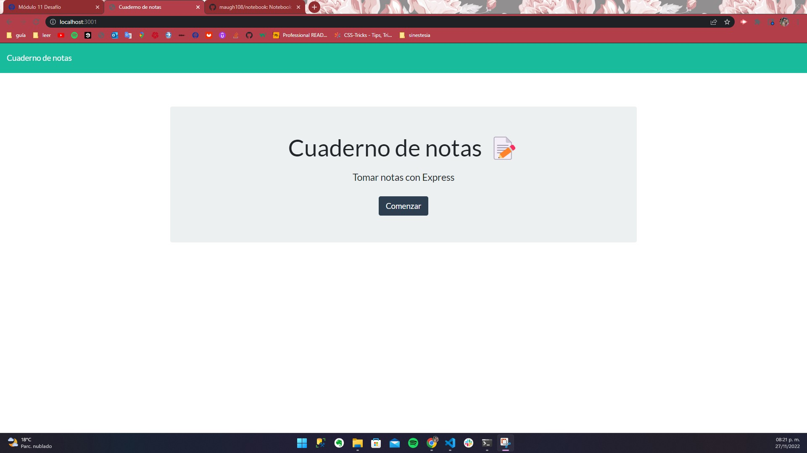
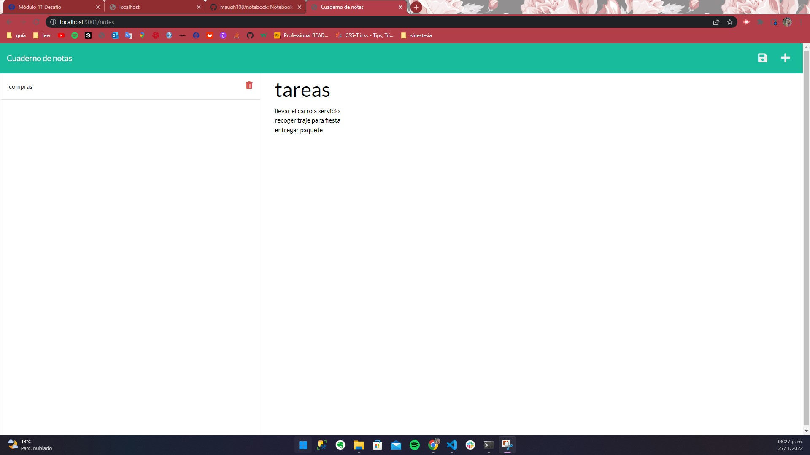

# Notebook
## Challenge Module 11  22/Oct/2022
### Último cambio: Mauricio García Hernández 29/Nov/2022

### User Story:
COMO propietario de una pequeña empresa
QUIERO poder escribir y guardar notas
PARA poder organizar mis pensamientos y llevar un registro de las tareas que necesito completar

### Criterios de aceptación:
DADA una aplicación para tomar notas
CUANDO abro el Cuaderno de notas
ENTONCES se me presenta una página de inicio con un enlace a una página de notas
CUANDO hago clic en el enlace a la página de notas
ENTONCES se me presenta una página con notas existentes enumeradas en la columna de la izquierda, más campos vacíos para ingresar un nuevo título de nota y el texto de la nota en la columna de la derecha
CUANDO introduzco un nuevo título de nota y el texto de la nota
ENTONCES aparece un icono Guardar en la navegación en la parte superior de la página
CUANDO hago clic en el icono Guardar
ENTONCES, la nueva nota que ingresé se guarda y aparece en la columna izquierda con las otras notas existentes
CUANDO hago clic en una nota existente en la lista de la columna izquierda
ENTONCES esa nota aparece en la columna de la derecha
CUANDO hago clic en el icono Escribir en la navegación en la parte superior de la página
ENTONCES se me presentan campos vacíos para ingresar un nuevo título de nota y el texto de la nota en la columna de la derecha

* Repositorio: https://github.com/maugh108/notebook
* URL: 